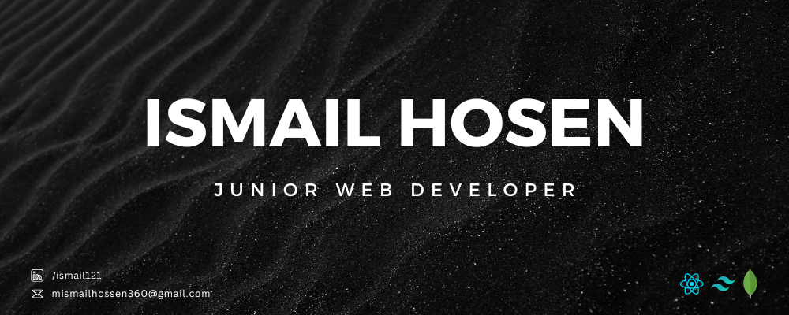

# 💫 About Me:

Hi there! I'm Ismail Hosen, a MERN Stack Developer passionate about creating
dynamic and user-centric web applications. Proficient in MongoDB, Express.js,
React, and Node.js, I specialize in crafting efficient, scalable solutions that
prioritize clean code and exceptional user experiences. With a keen eye for
detail and a drive to stay updated on emerging technologies, I'm dedicated to
transforming ideas into impactful digital realities. Let's build something
incredible together!

## 🌐 Reach me out:

# 💻 Technologies that I know:

# 📊 GitHub Stats:

 
 

## 🏆 GitHub Trophies

### ✍️ Random Dev Quote

### 🔝 Top Contributed Repo

---

## 👀 Current overview

### 🔭 I’m currently working on **a secret project.**

### 🌱 I’m currently learning **Advance Expressjs and Mongoose**

### 👯 I’m looking to collaborate on **GitHub**

### 💬 Ask me about **Web Development**

### 📫 How to reach me **mismailhossen360@gmail.com**

### 📄 Know about my experiences [https://drive.google.com/file/d/1GcA0N102uGD7FhCdDwE2BgV-r9LwtcLG/view?usp=sharing](https://drive.google.com/file/d/1GcA0N102uGD7FhCdDwE2BgV-r9LwtcLG/view?usp=sharing)

### ⚡ Fun fact **I think I am funny for my friends👯**
